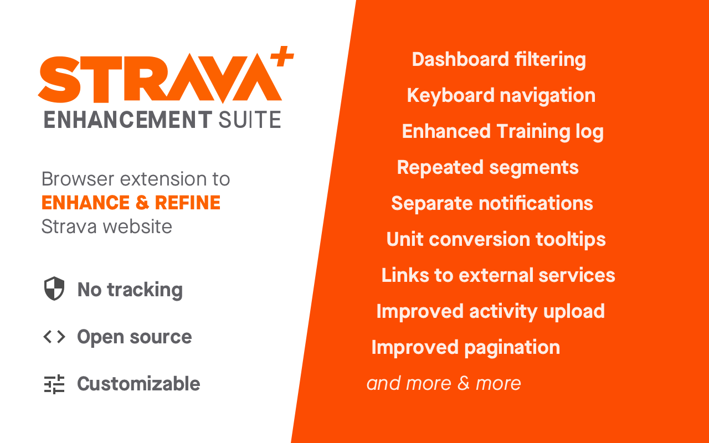

# Strava Enhancement Suite [![Chrome Web Store][Shield: CWS: Users]][Link: CWS]

> A browser extension to enhance Strava.com

<em>Dashboard filtering • Keyboard navigation • Enhanced Training log • Repeated segments • Separate notifications • Unit conversion tooltips • Links to external services • Improved activity upload • Improved pagination [and more & more](#features)</em>

## Install

* [Chrome extension from Chrome Web Store&nbsp;![Chrome Web Store][Shield: CWS: Version]][Link: CWS] – manually published stable version
  * [BETA version&nbsp;![Chrome Web Store][Shield: CWS: Version: Beta]][Link: CWS: Beta] – automatically published from `develop` branch
* Firefox add-on – TODO 👷‍
* Safari extension – probably not gonna happen

<strong>Install manually from source</strong>

* Clone (or otherwise download) this repository
* In Chrome, go to `chrome://extensions`
* Ensure "Developer mode" is ticked
* Click "Load unpacked" and select the `extension` directory within this repository
* Refresh any page on Strava - the extension will now be active

---

  

---

## Features

*All features are customizable in options*

**Check all features with description & images on [strajk.github.io/strava-enhancement-suite](https://strajk.github.io/strava-enhancement-suite)**

<table>

<tr>
  <td><strong>General</strong></td>
  <td><strong>Default</strong></td>
</tr>

<tr>
  <td>Submit forms with <kbd>cmd/ctrl</kbd> + <kbd>Enter</kbd></td>
  <td>✅</td>
</tr>

<tr>
  <td>Hide Social Sharing</td>
  <td>➖</td>
</tr>

<tr>
  <td>Hide Premium badges</td>
  <td>➖</td>
</tr>

<tr>
  <td>Improve pagination</td>
  <td>✅</td>
</tr>

<tr>
  <td>Units conversion tooltips on hover</td>
  <td>✅</td>
</tr>

<tr>
  <td>Separated notifications by type</td>
  <td>➖</td>
</tr>

<tr>
  <td>Enhance typography while typing (e.g. <code>-></code> with <code>&rarr;</code>)</td>
  <td>✅</td>
</tr>

<tr>
  <td><strong>Dashboard</strong></td>
  <td></td>
</tr>

<tr>
  <td>Keyboard controls for navigation, giving kudos, and commenting</td>
  <td>✅</td>
</tr>

<tr>
  <td>Hide Challenge feed entries</td>
  <td>➖</td>
</tr>

<tr>
  <td>Hide Club feed entries</td>
  <td>➖</td>
</tr>

<tr>
  <td>Hide Goal feed entries</td>
  <td>➖</td>
</tr>

<tr>
  <td>Hide Route feed entries</td>
  <td>➖</td>
</tr>

<tr>
  <td>Hide Promotion feed entries</td>
  <td>➖</td>
</tr>

<tr>
  <td>Hide Training plan feed entries</td>
  <td>➖</td>
</tr>

<tr>
  <td>Hide turbo-trainer / virtual rides (e.g. Zwift)</td>
  <td>➖</td>
</tr>

<tr>
  <td>Enlarge on hover actions</td>
  <td>➖</td>
</tr>

<tr>
  <td>Swap club & challenges</td>
  <td>➖</td>
</tr>

<tr>
  <td>Hide "Yearly Goals"</td>
  <td>➖</td>
</tr>

<tr>
  <td>Hide "Upcoming"</td>
  <td>➖</td>
</tr>

<tr>
  <td>Show button to give Kudos to all</td>
  <td>➖</td>
</tr>

<tr>
  <td><strong>Activity</strong></td>
  <td></td>
</tr>

<tr>
  <td>Repeated segments</td>
  <td>✅</td>
</tr>

<tr>
  <td>External links</td>
  <td>✅</td>
</tr>

<tr>
  <td>Show Running cadence by default</td>
  <td>✅</td>
</tr>

<tr>
  <td>Show Running heart rate by default</td>
  <td>✅</td>
</tr>

<tr>
  <td>Show Running Grade Adjusted Pace (GAP) by default</td>
  <td>✅</td>
</tr>

<tr>
  <td>Show Variability Index by default</td>
  <td>✅</td>
</tr>

<tr>
  <td>Show Estimated FTP by default</td>
  <td>✅</td>
</tr>

<tr>
  <td>Show Running TSS by default</td>
  <td>✅</td>
</tr>

<tr>
  <td>Hide calories</td>
  <td>➖</td>
</tr>

<tr>
  <td>Show hidden efforts</td>
  <td>✅</td>
</tr>

<tr>
  <td>Sort starred segments first</td>
  <td>✅</td>
</tr>

<tr>
  <td>Chart controls colors</td>
  <td>✅</td>
</tr>

<tr>
  <td>Shortcuts on Activity page</td>
  <td>✅</td>
</tr>

<tr>
  <td>Improved UX on Activity editing page</td>
  <td>✅</td>
</tr>

<tr>
  <td><strong>Training</strong></td>
  <td></td>
</tr>

<tr>
  <td>My Activities: Expand latest activity on page load</td>
  <td>➖</td>
</tr>

<tr>
  <td>Training Log: Enhanced Overview</td>
  <td>✅</td>
</tr>

<tr>
  <td><strong>Search</strong></td>
  <td></td>
</tr>

<tr>
  <td>Improve UX on Search</td>
  <td>✅</td>
</tr>

<tr>
  <td><strong>Athlete</strong></td>
  <td></td>
</tr>

<tr>
  <td>Compare running</td>
  <td>➖</td>
</tr>

<tr>
  <td><strong>Upload</strong></td>
  <td></td>
</tr>

<tr>
  <td>Improve activity upload</td>
  <td>✅</td>
</tr>

<tr>
  <td>Improve UX on Manual Upload</td>
  <td>✅</td>
</tr>

<tr>
  <td><strong>Other</strong></td>
  <td></td>
</tr>

<tr>
  <td>Show same-activity Flybys only</td>
  <td>➖</td>
</tr>

</table>

## Contribute

Feel free to! 🙏

## Authors

* [lamby](https://github.com/lamby) – creator
* [Strajk](https://github.com/Strajk/) – current maintainer

## Other browser extensions for Strava

- [Sauce for Strava](https://saucellc.io/) – the masterpiece by [Justin Mayfield](https://github.com/mayfield)
  - Adds powerful analytics features (peak performance for power, hr, pace, …) and extends existing ones
  - Adds performance predictor
  - Adds exporting of any activity to GPX/TCX
  - Modifies UI – dark mode, responsiveness, inline comments, basic dashboard filtering, …
  - … [and more](https://saucellc.io/)
  - 🐙 [Open-source](https://github.com/SauceLLC/sauce4strava)
  - ✅ Works fine with Strava Enhancement Suite, some features overlap:
    - Dashboard filtering (virtual activities, challenges, promotions)
    - Hiding subscription upsells
- [Elevate](https://thomaschampagne.github.io/elevate/) – the legendary extension by [Thomas Champagne](https://twitter.com/champagnethomas), previously called *stravistix*
  - Whole training platform rebuilt on top of Strava
  - Enhances stats on activities & segments
  - Adds exporting of segments to GPS
  - Enhances segments ranking
  - … [and more](https://thomaschampagne.github.io/elevate/)
  - 🐙 [Open-source](https://github.com/thomaschampagne/elevate)
  - ✅ Works fine with Strava Enhancement Suite, some features overlap:
    - Dashboard filtering (virtual activities, challenges, promotions, posts, activities below threshold)
- [Str*Viewer](http://straviewer.com/)
  - Modifies Dashboard UI
  - Not Open-source
  - 🤔 Not sure about compatibility with Strava Enhancement Suite

## Disclaimer

This software is not endorsed by Strava. Please do not ask them for support.
The term STRAVA and the Strava logo are the exclusive trademarks of, and are owned by, Strava Inc.

[Shield: CWS: Users]: https://img.shields.io/chrome-web-store/users/egelalffpmicecakegglddmhlbdiemlg?label=Chrome+Extension
[Shield: CWS: Version]: https://img.shields.io/chrome-web-store/v/egelalffpmicecakegglddmhlbdiemlg?label=
[Shield: CWS: Version: Beta]: https://img.shields.io/chrome-web-store/v/oaioodcklbhlefejbglemgjndhckgklf?label=
[Link: CWS]: https://chrome.google.com/webstore/detail/egelalffpmicecakegglddmhlbdiemlg
[Link: CWS: Beta]: https://chrome.google.com/webstore/detail/oaioodcklbhlefejbglemgjndhckgklf
