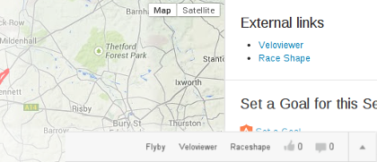

# Strava Enhancement Suite [![Chrome Web Store][Shield: CWS: Users]][Link: CWS]

> A browser extension to enhance Strava.com

<em>Repeated segments • Dashboard filtering (hide virtual rides/commutes/promos/…) • Keyboard navigation • Customizable defaults • Improved pagination • Improved activity upload • Separate notifications • Unit conversion tooltips on hover • Enhanced Training log [and more & more](#features-overview)</em>

## Install

* [Chrome extension from Chrome Web Store&nbsp;![Chrome Web Store][Shield: CWS: Version]][Link: CWS] – manually published stable version
  * [BETA version&nbsp;![Chrome Web Store][Shield: CWS: Version: Beta]][Link: CWS: Beta] – automatically published from `develop` branch
* Firefox add-on – TODO 👷‍
* Safari extension – probably not gonna happen

<strong>Install manually from source</strong>

* Clone (or otherwise download) this repository
* In Chrome, go to `chrome://extensions`
* Ensure "Developer mode" is ticked
* Click "Load unpacked" and select the `extension` directory within this repository
* Refresh any page on Strava - the extension will now be active

---

  

---

## Features overview

**🎛 All features can be disabled/enabled in options**

<table>

<tr>
  <td><strong>General</strong></td>
  <td><strong>Default</strong></td>
  <td>🖼</td>
</tr>

<tr>
  <td>Submit forms with <kbd>cmd/ctrl</kbd> + <kbd>Enter</kbd></td>
  <td>✅</td>
  <td></td>
</tr>

<tr>
  <td>Hide Social Sharing buttons (Facebook, Twitter, email)</td>
  <td>➖</td>
  <td><a target="_blank" href="./extension/pages/img/hide_invite_friends.png?raw=true">→</a></td>
</tr>

<tr>
  <td>Hide Premium badges</td>
  <td>➖</td>
  <td><a target="_blank" href="./extension/pages/img/hide_premium_badges.png?raw=true">→</a></td>
</tr>

<tr>
  <td>Improve pagination</td>
  <td>✅</td>
  <td><a target="_blank" href="./extension/pages/img/improve_pagination.png?raw=true">→</a></td>
</tr>

<tr>
  <td>Units conversion tooltips on hover</td>
  <td>✅</td>
  <td><a target="_blank" href="./extension/pages/img/convert_units.png?raw=true">→</a></td>
</tr>

<tr>
  <td>Separated notifications by type</td>
  <td>➖</td>
  <td><a target="_blank" href="./extension/pages/img/separate_notifications.png?raw=true">→</a></td>
</tr>

<tr>
  <td>Enhance typography while typing (e.g. <code>-></code> with <code>&rarr;</code>)</td>
  <td>✅</td>
  <td></td>
</tr>

<tr>
  <td><strong>Dashboard</strong></td>
  <td></td>
  <td></td>
</tr>

<tr>
  <td>Keyboard controls for navigation, giving kudos, and commenting</td>
  <td>✅</td>
  <td></td>
</tr>

<tr>
  <td>Hide Challenge feed entries</td>
  <td>➖</td>
  <td></td>
</tr>

<tr>
  <td>Hide Club feed entries</td>
  <td>➖</td>
  <td></td>
</tr>

<tr>
  <td>Hide Goal feed entries</td>
  <td>➖</td>
  <td></td>
</tr>

<tr>
  <td>Hide Route feed entries</td>
  <td>➖</td>
  <td></td>
</tr>

<tr>
  <td>Hide Promotion feed entries</td>
  <td>➖</td>
  <td></td>
</tr>

<tr>
  <td>Hide Training plan feed entries</td>
  <td>➖</td>
  <td></td>
</tr>

<tr>
  <td>Hide turbo-trainer / virtual rides (e.g. Zwift)</td>
  <td>➖</td>
  <td></td>
</tr>

<tr>
  <td>Enlarge on hover actions</td>
  <td>➖</td>
  <td></td>
</tr>

<tr>
  <td>Swap club & challenges</td>
  <td>➖</td>
  <td></td>
</tr>

<tr>
  <td>Hide "Yearly Goals"</td>
  <td>➖</td>
  <td></td>
</tr>

<tr>
  <td>Hide "Upcoming"</td>
  <td>➖</td>
  <td></td>
</tr>

<tr>
  <td>Show button to give Kudos to all</td>
  <td>➖</td>
  <td></td>
</tr>

<tr>
  <td><strong>Activity</strong></td>
  <td></td>
  <td></td>
</tr>

<tr>
  <td>Repeated segments</td>
  <td>✅</td>
  <td><a target="_blank" href="./extension/pages/img/repeated_segments.png?raw=true">→</a></td>
</tr>

<tr>
  <td>External links</td>
  <td>✅</td>
  <td><a target="_blank" href="./extension/pages/img/external_links.png?raw=true">→</a></td>
</tr>

<tr>
  <td>Show Running cadence by default</td>
  <td>✅</td>
  <td><a target="_blank" href="./extension/pages/img/running_cadence.png?raw=true">→</a></td>
</tr>

<tr>
  <td>Show Running heart rate by default</td>
  <td>✅</td>
  <td><a target="_blank" href="./extension/pages/img/running_heart_rate.png?raw=true">→</a></td>
</tr>

<tr>
  <td>Show Running Grade Adjusted Pace (GAP) by default</td>
  <td>✅</td>
  <td><a target="_blank" href="./extension/pages/img/running_gap.png?raw=true">→</a></td>
</tr>

<tr>
  <td>Show Variability Index by default</td>
  <td>✅</td>
  <td><a target="_blank" href="./extension/pages/img/variability_index.png?raw=true">→</a></td>
</tr>

<tr>
  <td>Show Estimated FTP by default</td>
  <td>✅</td>
  <td><a target="_blank" href="./extension/pages/img/estimated_ftp.png?raw=true">→</a></td>
</tr>

<tr>
  <td>Show Running TSS by default</td>
  <td>✅</td>
  <td><a target="_blank" href="./extension/pages/img/running_tss.png?raw=true">→</a></td>
</tr>

<tr>
  <td>Hide calories</td>
  <td>➖</td>
  <td></td>
</tr>

<tr>
  <td>Show hidden efforts</td>
  <td>✅</td>
  <td></td>
</tr>

<tr>
  <td>Sort starred segments first</td>
  <td>✅</td>
  <td></td>
</tr>

<tr>
  <td>Chart controls colors</td>
  <td>✅</td>
  <td><a target="_blank" href="./extension/pages/img/chart_controls_colors.png?raw=true">→</a></td>
</tr>

<tr>
  <td>Shortcuts on Activity page</td>
  <td>✅</td>
  <td></td>
</tr>

<tr>
  <td>Improved UX on Activity editing page</td>
  <td>✅</td>
  <td></td>
</tr>

<tr>
  <td><strong>Training</strong></td>
  <td></td>
  <td></td>
</tr>

<tr>
  <td>My Activities: Expand latest activity on page load</td>
  <td>➖</td>
  <td></td>
</tr>

<tr>
  <td>Training Log: Enhanced Overview</td>
  <td>✅</td>
  <td><a target="_blank" href="./extension/pages/img/training_log_overview.png?raw=true">→</a></td>
</tr>

<tr>
  <td><strong>Search</strong></td>
  <td></td>
  <td></td>
</tr>

<tr>
  <td>Improve UX on Search</td>
  <td>✅</td>
  <td></td>
</tr>

<tr>
  <td><strong>Athlete</strong></td>
  <td></td>
  <td></td>
</tr>

<tr>
  <td>Compare running</td>
  <td>➖</td>
  <td><a target="_blank" href="./extension/pages/img/side_by_side_running.png?raw=true">→</a></td>
</tr>

<tr>
  <td><strong>Upload</strong></td>
  <td></td>
  <td></td>
</tr>

<tr>
  <td>Improve activity upload</td>
  <td>✅</td>
  <td></td>
</tr>

<tr>
  <td>Imporve UX on Manual Upload</td>
  <td>✅</td>
  <td></td>
</tr>

<tr>
  <td><strong>Other</strong></td>
  <td></td>
  <td></td>
</tr>

<tr>
  <td>Show same-activity Flybys only</td>
  <td>➖</td>
  <td></td>
</tr>

</table>

## Contribute

Feel free to! 🙏

## Authors

* [lamby](https://github.com/lamby) – creator
* [Strajk](https://github.com/Strajk/) – current maintainer

## Disclaimer

This software is not endorsed by Strava. Please do not ask them for support.
The term STRAVA and the Strava logo are the exclusive trademarks of, and are owned by, Strava Inc.

---
---
---

## Features in detail

- **General: Submit forms with <kbd>cmd/ctrl</kbd> + <kbd>Enter</kbd>**

  - **Enabled by default:** ✅
  - **Description:** Allows submitting forms by pressing <kbd>cmd/ctrl</kbd> + <kbd>Enter</kbd>. Works on comments, editing activities, and uploading new activities.  

- **General: Hide Social Sharing buttons (Facebook, Twitter, email)**

  - **Enabled by default:** ➖
  - **Description:** Hide social networking buttons (Facebook, Twitter, email), including invitations to invite/find friends on Strava.  

- **General: Hide Premium badges**

  - **Enabled by default:** ➖
  - **Description:** Hide Premium badges on avatars. Subscriber status on an athlete's page is still shown.  

- **General: Improve pagination**

  - **Enabled by default:** ✅
  - **Description:** Add "first" and "last" links to paginated features.  

- **General: Units conversion tooltips on hover**

  - **Enabled by default:** ✅
  - **Description:** Show converted units when you hover your mouse over numbers.  

- **General: Separated notifications by type**

  - **Enabled by default:** ➖
  - **Description:** Separate notification types for kudos, comments, uploads, challenges, follows, and others  

- **General: Enhance typography while typing (e.g. <code>-></code> with <code>&rarr;</code>)**

  - **Enabled by default:** ✅
  - **Description:** Replace <code>--</code> with <code>&ndash;</code>, <code>-></code> with <code>&rarr;</code>, <code>(L)</code> with <code>&hearts;</code> and so on…  

- **Dashboard: Keyboard controls for navigation, giving kudos, and commenting**

  - **Enabled by default:** ✅
  - **Description:** Enable keyboard controls on the dashboard:
  <kbd>J</kbd> - Up (previous) 
  <kbd>K</kbd> - Down (next) 
  <kbd>L</kbd> - Kudos (like) 
  <kbd>C</kbd> - Comment 
  <kbd>Enter</kbd> - Go to activity  (hold shift to open in a new tab/window)
  <kbd>E</kbd> - Edit activity  (hold shift to open in a new tab/window)
  <kbd>U</kbd> - Go to athlete  (hold shift to open in a new tab/window)   

- **Dashboard: Hide Challenge feed entries**

  - **Enabled by default:** ➖
  - **Description:**   

- **Dashboard: Hide Club feed entries**

  - **Enabled by default:** ➖
  - **Description:**   

- **Dashboard: Hide Goal feed entries**

  - **Enabled by default:** ➖
  - **Description:**   

- **Dashboard: Hide Route feed entries**

  - **Enabled by default:** ➖
  - **Description:**   

- **Dashboard: Hide Promotion feed entries**

  - **Enabled by default:** ➖
  - **Description:**   

- **Dashboard: Hide Training plan feed entries**

  - **Enabled by default:** ➖
  - **Description:**   

- **Dashboard: Hide turbo-trainer / virtual rides (e.g. Zwift)**

  - **Enabled by default:** ➖
  - **Description:**   

- **Dashboard: Enlarge on hover actions**

  - **Enabled by default:** ➖
  - **Description:** Make various elements (photos, maps, avatars, etc.) larger when you hover over them.  

- **Dashboard: Swap club & challenges**

  - **Enabled by default:** ➖
  - **Description:** Swap the ordering of the "Clubs" and "Challenges" module on the dashboard.  

- **Dashboard: Hide "Yearly Goals"**

  - **Enabled by default:** ➖
  - **Description:** Hide the "Yearly Goals" module on the dashboard.  

- **Dashboard: Hide "Upcoming"**

  - **Enabled by default:** ➖
  - **Description:** Hide "Upcoming" module on the dashboard if you have no upcoming races, events or goals coming soon. Also hides the "Discover More" sub-module.  

- **Dashboard: Show button to give Kudos to all**

  - **Enabled by default:** ➖
  - **Description:** Show button in the header bar to give Kudos to all displayed activities  

- **Activity: Repeated segments**

  - **Enabled by default:** ✅
  - **Description:** Show aggregate segment data (fastest, slowest, average, total distance, total elevation, etc.) when segments are repeated within an activity.  

- **Activity: External links**

  - **Enabled by default:** ✅
  - **Description:** Show links to Veloviewer, Race Shape, KOM Club etc. on activity, segment detail and Challenge pages.  

- **Activity: Show Running cadence by default**

  - **Enabled by default:** ✅
  - **Description:** Show running cadence by default in elevation profile.  

- **Activity: Show Running heart rate by default**

  - **Enabled by default:** ✅
  - **Description:** Show running heart rate by default in elevation profile.  

- **Activity: Show Running Grade Adjusted Pace (GAP) by default**

  - **Enabled by default:** ✅
  - **Description:** Show running Grade Adjusted Pace (GAP) by default in elevation profile.  

- **Activity: Show Variability Index by default**

  - **Enabled by default:** ✅
  - **Description:** Calculate a Variability Index (VI) from the weighted average power and the average power, an indication of how "smooth" a ride was. A VI of 1.0 would mean perfect pacing. (Requires a power meter.)  

- **Activity: Show Estimated FTP by default**

  - **Enabled by default:** ✅
  - **Description:** Select "Show Estimated FTP" by default on Power Curve.  

- **Activity: Show Running TSS by default**

  - **Enabled by default:** ✅
  - **Description:** Estimates a run"s Training Stress Score from its Grade Adjusted Pace distribution.  

- **Activity: Hide calories**

  - **Enabled by default:** ➖
  - **Description:** Hide the number of calories burned on your own activity pages.  

- **Activity: Show hidden efforts**

  - **Enabled by default:** ✅
  - **Description:** When there are too many segments/efforts on a particular ride, Strava hides them behind a "Show X hidden efforts" button. Enabling this option shows these efforts by default.  

- **Activity: Sort starred segments first**

  - **Enabled by default:** ✅
  - **Description:** Show 'starred' segments at the top of lists instead of in their geographical order.  

- **Activity: Chart controls colors**

  - **Enabled by default:** ✅
  - **Description:** Add colors to chart legend  

- **Activity: Shortcuts on Activity page**

  - **Enabled by default:** ✅
  - **Description:** Allow editing own activity by clicking on it's title or pressing `e` key  

- **Activity: Improved UX on Activity editing page**

  - **Enabled by default:** ✅
  - **Description:** Autofocus title field; disable autocomplete.  

- **Training: My Activities: Expand latest activity on page load**

  - **Enabled by default:** ➖
  - **Description:** When opening My Activities, expand latest activity for editing automatically.  

- **Training: Training Log: Enhanced Overview**

  - **Enabled by default:** ✅
  - **Description:** Show stats for all sports in the overview section in Training Log  

- **Search: Improve UX on Search**

  - **Enabled by default:** ✅
  - **Description:** Remember search values in URL  

- **Athlete: Compare running**

  - **Enabled by default:** ➖
  - **Description:** Changes the default sport for the "Side by Side comparison" module to running.  

- **Upload: Improve activity upload**

  - **Enabled by default:** ✅
  - **Description:** Add the ability to automatically "Save & View", and increase the size of the description boxes to the manual "Upload and Sync Your Activities" manual upload page,  

- **Upload: Imporve UX on Manual Upload**

  - **Enabled by default:** ✅
  - **Description:** Allow pre-filling params from URL  

- **Other: Show same-activity Flybys only**

  - **Enabled by default:** ➖
  - **Description:** Show same-activity Flybys only (runs or rides) in the Flyby viewer.  

[Shield: CWS: Users]: https://img.shields.io/chrome-web-store/users/egelalffpmicecakegglddmhlbdiemlg?label=Chrome+Extension
[Shield: CWS: Version]: https://img.shields.io/chrome-web-store/v/egelalffpmicecakegglddmhlbdiemlg?label=
[Shield: CWS: Version: Beta]: https://img.shields.io/chrome-web-store/v/oaioodcklbhlefejbglemgjndhckgklf?label=
[Link: CWS]: https://chrome.google.com/webstore/detail/egelalffpmicecakegglddmhlbdiemlg
[Link: CWS: Beta]: https://chrome.google.com/webstore/detail/oaioodcklbhlefejbglemgjndhckgklf
